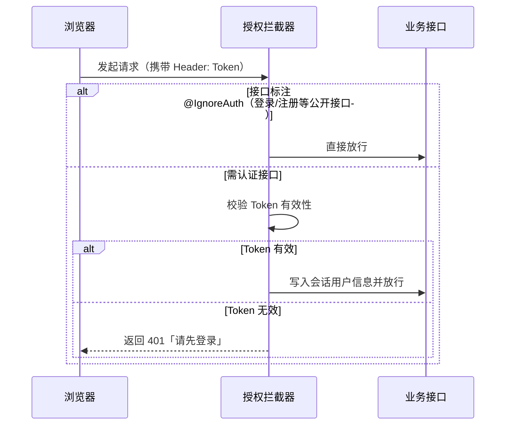

# 校园周边美食分享平台（Food Sharing Platform）

> 面向校园场景的美食分享社区：学生可以浏览、搜索校园周边的美食分享，收藏心仪店铺，管理好友关系；管理员通过后台维护美食内容与轮播图。前后端分离架构，覆盖登录鉴权、内容管理、社交互动与权限控制的完整业务闭环。

---

## ✨ 项目亮点

- **安全设计**：密码全链路 **BCrypt 加密**；数据库密码**环境变量注入**（无硬编码）；CORS **白名单机制**；文件上传**扩展名白名单校验**；富文本**前端 XSS 过滤**（DOMPurify）。
- **权限体系**：基于 Token 的登录态校验 + 拦截器**分级鉴权**（管理员 / 普通用户），管理员接口独立保护。
- **缓存优化**：静态资源 `Cache-Control: no-cache` 策略 + 图片**版本化命名**，彻底规避浏览器旧图缓存问题。
- **工程化**：前端 Vite 代理、自动导入组件、统一 Axios 封装；后端 MyBatis Plus 通用 CRUD，结构清晰。

---

## 🛠 技术栈

| 分层 | 技术 | 版本 |
| --- | --- | --- |
| 前端框架 | Vue 3 (Composition API) | 3.5 |
| 前端构建 | Vite | 6.x |
| UI 组件库 | Element Plus | 2.9 |
| 路由 / 状态 | Vue Router 4 / 组合式 | 4.5 |
| HTTP / 安全 | Axios + DOMPurify | 1.7 / 3.4 |
| 数据可视化 | ECharts | 5.6 |
| 后端框架 | Spring Boot | 2.7.18 |
| ORM | MyBatis Plus | 2.3 |
| 权限 / 加密 | Shiro + Spring Security Crypto（BCrypt） | 1.13 / 5.7 |
| 数据库 | MySQL | 8.0 |
| 语言 | Java 17 / JavaScript (ES Module) | — |

---

## 🏗 系统架构

```mermaid
flowchart LR
    subgraph 前端 Vite Dev (8081)
        V[Vue 3 单页应用]
    end
    subgraph 后端 Spring Boot (8080/api)
        API[RESTful Controller]
        I[授权拦截器<br/>AuthorizationInterceptor]
        MP[MyBatis Plus]
    end
    DB[(MySQL 8<br/>fs)]

    V -- "/api 请求经 Vite 代理转发" --> API
    API --> I
    I --> MP
    MP --> DB
```

**请求鉴权流程**：



---

## 📦 功能模块

### 用户端
- **首页**：轮播图、美食推荐、关键词搜索、分页浏览
- **美食鉴赏**：美食列表、美食详情（价格 / 浏览数 / 介绍）
- **我的收藏**：收藏 / 取消收藏心仪美食
- **我的好友**：添加 / 删除好友
- **账号体系**：登录 / 注册，支持管理员、用户、注册用户多角色

### 管理端
- **工作台**：数据总览（ECharts 图表）
- **用户管理**：普通用户 / 注册用户维护
- **美食鉴赏管理**：美食增删改查（富文本编辑）
- **轮播图管理**：首页 Banner 配置

### 权限说明
- 管理员接口（用户管理、内容管理、配置管理等）由拦截器**独立保护**，仅 `管理员` 角色可访问
- 普通用户仅能维护自己的资料（服务端校验 session 用户身份）

---

## 🔐 安全设计（重点）

| 安全项 | 实现方式 |
| --- | --- |
| 密码存储 | 注册 / 登录 / 重置全链路 **BCrypt** 加密，杜绝明文落库 |
| 数据库凭据 | `password: ${DB_PASSWORD}` **环境变量注入**，仓库无默认密码 |
| 跨域策略 | CORS **白名单**，仅放行 `localhost:8080/8081` 与 `127.0.0.1:8080/8081` |
| 文件上传 | 后端**扩展名白名单**（jpg/png/gif/mp4/doc 等），拦截脚本上传 |
| 密码重置 | 必须登录后才能操作，不允许匿名重置他人密码 |
| 前端安全 | 富文本内容经 **DOMPurify** 过滤，防 XSS |
| 图片缓存 | 静态资源 `no-cache` + 图片版本化命名，保证内容及时更新 |

---

## 🗄 数据库设计

| 表名 | 说明 | 关键字段 |
| --- | --- | --- |
| `users` | 管理员账号 | username, password(BCrypt), role |
| `yonghu` | 普通用户 | yonghuming, mima(BCrypt), xingming, zhaopian |
| `defaultuser` | 注册用户 | username, mima(BCrypt), name, picture |
| `meishijianshang` | 美食分享 | meishimingcheng, meishijieshao, meishizhaopian, shangpinjiage |
| `storeup` | 收藏记录 | userid, refid, tablename, picture |
| `wodehaoyou` | 好友关系 | 关联用户双方 ID |
| `discussmeishijianshang` | 美食评论 | 关联美食与用户 |
| `config` | 系统配置 / 轮播图 | name, value |
| `token` | 登录令牌 | userid, token, role, expiretime |

> 表间通过主键 ID 关联：用户收藏美食（`storeup.refid → meishijianshang.id`），评论 / 好友关系均以用户 ID 关联。

---

## 🚀 快速开始

### 环境要求
- JDK 17+、Maven 3.8+
- MySQL 8.0+
- Node.js 18+

### 1. 初始化数据库
```bash
mysql -uroot -p < FS.sql      # 创建 fs 库并导入数据
```
> 数据库密码通过环境变量注入：`setx DB_PASSWORD "你的密码"`（Windows）或 `export DB_PASSWORD=你的密码`（Linux/macOS）。连接配置见 `back/src/main/resources/application.yml`。

### 2. 启动后端（端口 8080，上下文 /api）
```bash
cd back
mvn spring-boot:run
```

### 3. 启动前端（端口 8081）
```bash
cd front
npm install
npm run dev
```

访问 **http://localhost:8081**

---

## 📁 项目结构

```text
├── front/                    # Vue 3 前端
│   ├── src/
│   │   ├── components/       # 公共组件（FileUpload/Editor/图表）
│   │   ├── router/           # 路由配置
│   │   ├── utils/            # Axios 封装、URL 解析、XSS 过滤
│   │   └── views/            # 用户端 + 管理端页面
│   ├── vite.config.js        # 开发代理 /api → 8080
│   └── package.json
├── back/                     # Spring Boot 后端
│   ├── src/main/java/com/
│   │   ├── config/           # 拦截器注册、资源缓存策略
│   │   ├── interceptor/      # 登录鉴权 + CORS 白名单
│   │   ├── controller/       # RESTful 接口
│   │   ├── service/          # 业务逻辑层
│   │   ├── dao/              # MyBatis Plus 数据访问
│   │   └── entity/           # 实体模型
│   ├── src/main/resources/   # 配置与静态资源（上传目录）
│   └── pom.xml
├── FS.sql                    # 数据库初始化脚本（含脱敏示例数据）
└── README.md
```

---

## 👤 演示账号

| 角色 | 用户名 | 密码 |
| --- | --- | --- |
| 管理员 | `admin` | `123456` |
| 普通用户 | `用户1` | `123456` |

> 密码均以 BCrypt 加密存储。示例数据（手机号 / 邮箱 / 身份证号）已脱敏，仅用于功能演示。

---

## 🧭 后续规划

- 接入 Redis 做 Token 缓存与接口限流
- 美食点赞 / 评分聚合与个性化推荐
- 图片上传改造为对象存储（OOS/OSS）并支持 CDN
- 单元测试与接口自动化测试覆盖
